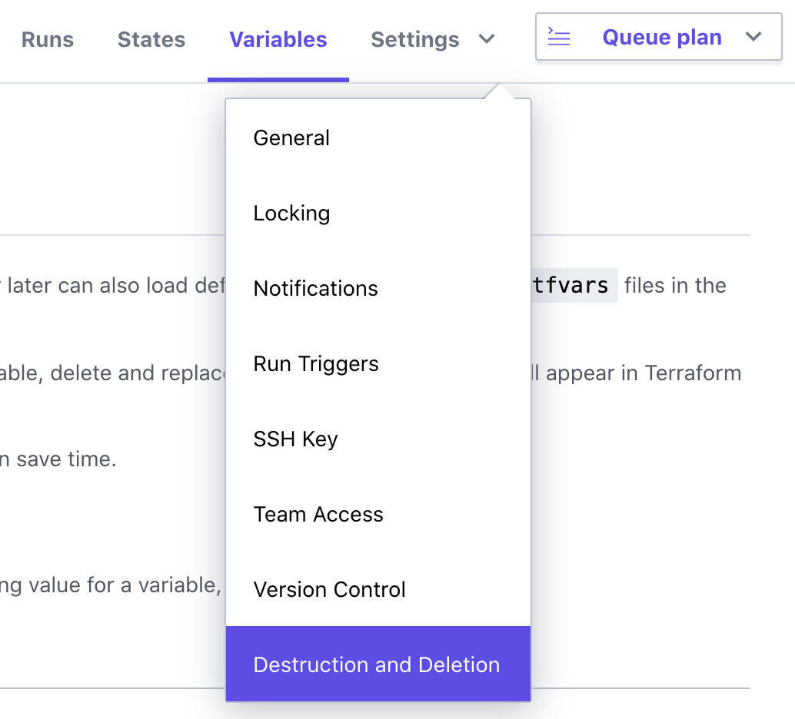
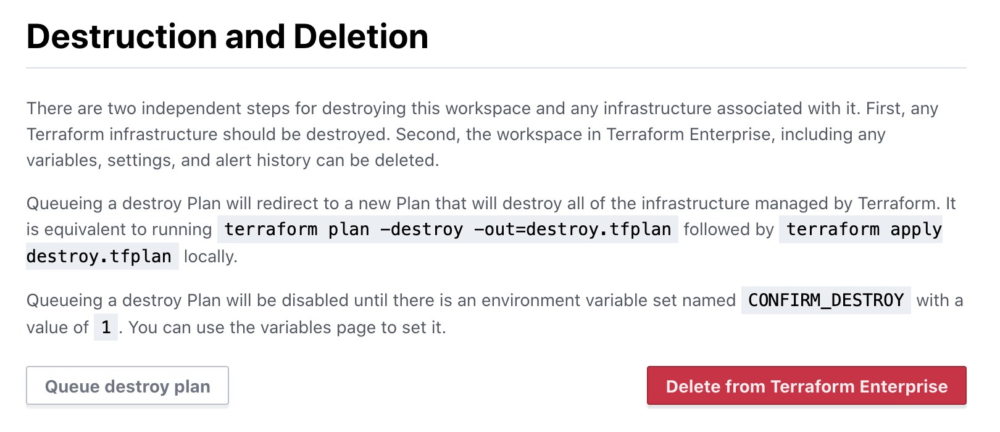

# Terraform Enterprise - Workspaces

## Expected Outcome

In this challenge, you will create a repository, a TFE workspace, and link them together.

## How to

### [GitHub] Create a new github repository

Login to github and create a new repository by navigating to <https://github.com/new>.

Use the following settings:
- `name` = "server-build"
- Public repo
- Check "Initialize this repository with a README"
- Add `.gitignore` of type "Terraform"

Once created, clone the repository to your local machine.

### [Local] Update your Repository

In your repository copy the `main.tf` file from your default module along with the `server` folder and contents.

Commit the changes in GitHub.

```
git add .
git commit -m "update with terraform code"
git push
```

> **WARNING** :
Do not upload your `terraform.tfvars` into a public GitHub repository because this file does contain sensitive information about the AWS account.

```sh
Example

ami                    = ami-03e33c1cefd1d3d74
subnet_id              = subnet-0a5e93f323f7f9138
identity               = terraform-training-ant
vpc_security_group_ids = ["sg-02713b4780094ac55"]
web_count              = 2
```


### Connect VCS to Workspace
Connect your Workspace to the GitHub `server-build` repository


### [TFE] Plan and Apply

Queue another plan, if all looks good, Apply!

### [TFE] Destroy

Click the Workspace "Setting" menu -> "Destruction and Deletion"



Click the "Queue destroy plan" to queue a destructive plan.



If the destroy plan looks good, apply it.