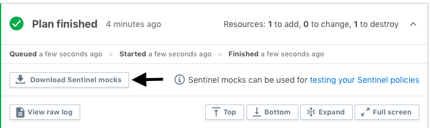

# Lab 7: Sentinel

Duration: 25 minutes

This lab demonstrates how to write, test, and deploy simple Sentinel policies.

- Task 1: Define a local policy and test it
- Task 2: Define a policy with data structures
- Task 3: Run a policy on Terraform Cloud
- Task 4: Use Mock data generated from Terraform Cloud to test

## Prerequisites

For this lab, we'll assume that you've installed [Terraform](https://www.terraform.io/downloads.html), that you have a [Terraform Cloud](https://app.terraform.io) account, and that you've created a Terraform Cloud workspace for the [TF101](https://github.com/hashicorp/demo-terraform-101) demo application (`after-tfc` branch).

You'll also need the [Sentinel Simulator](https://docs.hashicorp.com/sentinel/downloads), which is pre-installed on your lab instance.

## Task 1: Define a local policy and test it

In this task, you'll define the simplest possible Sentinel policy in order to understand how rules work and how tests are defined.

### Step 7.1.1: Create a simple policy

Create a directory for your Sentinel project named `simple`. Create a file inside named `simple.sentinel`. Your full path should be `~/lab_7_sentinel_demo/simple/`.

```shell
mkdir -p ~/lab_7_sentinel_demo/simple && cd $_
```

```shell
touch simple.sentinel
```

The file will contain the bare minimum needed to satisfy a passing rule.

```bash
main = rule {
  true
}
```

The Sentinel Simulator will verify policies with `apply` without actually applying them to your configuration. To validate a policy in the Simulator, run

```shell
sentinel apply simple.sentinel
```

```
Pass
```

### Step 7.1.2: Write a passing test

Now create a corresponding test file that defines the passing condition. Since our rule is hard-coded to `true`, this will not require any additional variables, global state, or mocking.

Create a file named `pass.json` in a `test` directory within a subdirectory that matches the name of the policy (`simple`). Your full path should be `~/lab_7_sentinel_demo/simple/test/simple`.

```shell
mkdir -p ~/lab_7_sentinel_demo/simple/test/simple && cd $_
```

```shell
touch pass.json
```

Within `pass.json`, we can define a data structure that describes `test` rules, `global` variables, and `mock` data.

Type these contents into `pass.json`:

```json
{
  "test": {
    "main": true
  }
}
```

This declares a `main` rule and an expectation that the return value from `main` should be `true`.

### Step 7.1.3: Run the test

From the `simple` root directory, run `sentinel test`. The full path from which to execute is `~/lab_7_sentinel_demo/simple`.

```shell
cd ~/lab_7_sentinel_demo/simple/
sentinel test
```

```
PASS - simple.sentinel
  PASS - test/simple/pass.json
```

You should see that the main policy passed as well as the `JSON` test file that we defined.

## Task 2: Define a policy with global values and more complex data structures

For this task, you'll define a more complex policy that uses string values, a map value, and a more complex value that is similar to what you'll see in production.

### Step 7.2.1: Create a new policy that enforces an exact instance_type

Create a directory for a slightly more complex policy named `with-data`.


```shell
mkdir ~/lab_7_sentinel_demo/with-data && cd $_
```

```shell
touch with-data.sentinel
```

Define a rule that expects a global `instance_type` variable to be equal to `t2.medium`.

```bash
main = rule {
  instance_type_is_medium
}

instance_type_is_medium = rule {
  instance_type is "t2.medium"
}
```

Rules can be composed of other rules. When debugging or testing a policy, it is much easier to work with several small rules rather than one rule that has many conditions in it.

### Step 7.2.2: Implement a test that passes

Implement a test that defines `global` values expected by the policy. We can pre-populate the variables that are passed in to the policy. Then we can specify whether the policy should pass or fail based on the test data we've provided.

Create a JSON file in the `test` directory under a subdirectory that matches the name of the Sentinel policy (`with-data`). Your full path should be `~/lab_7_sentinel_demo/with-data/test/with-data`

```shell
mkdir -p ~/lab_7_sentinel_demo/with-data/test/with-data && cd $_
```

```shell
touch pass.json
```

For the successful scenario, we'll define `instance_type` under the `global` key in the JSON. We want to simulate a case where `instance_type` is given to the policy with a value of `t2.medium`.

Under the `test` section of the JSON, specify that the `main` rule should evaluate to `true`. You could optionally list the `instance_type_is_medium` rule and specify that it is expected to evaluate to `true` as well.

```json
{
  "global": {
    "instance_type": "t2.medium"
  },
  "test": {
    "main": true,
    "instance_type_is_medium": true
  }
}
```

### Step 7.2.3: Run tests

Run the tests in the root `with-data` directory (`~/lab_7_sentinel_demo/with-data/`). They should pass.

```shell
cd ~/lab_7_sentinel_demo/with-data/
sentinel test
```

```
PASS - with-data.sentinel
  PASS - test/with-data/pass.json
```

Try running the test suite again with the `-verbose` flag.

```shell
sentinel test -verbose
```

### Step 7.2.4: Use a map data structure

Let's use a data structure that approaches what we might see in a real-world use case. Define a rule that looks for a value in a map data structure, such as `ami.id`. Later, you'll learn to write a test that defines this. Update the main rule in `with-data.sentinel` with:

```bash
main = rule {
  instance_type_is_medium and
  ami_is_present
}
```

Implement the `ami_is_present` rule using `ami.id` and the `is` comparison keyword. Add the following to `with-data.sentinel`:

```bash
ami_is_present = rule {
  ami.id is "ami-e474db9c"
}
```

### Step 7.2.5: Define a map structure in the passing test data

Add a nested `ami` with `id` value to your JSON data structure in `pass.json` in your `test/with-data/` folder (full path `~/lab_7_sentinel_demo/with-data/test/with-data/`). Overwrite with:

```bash
cd ~/lab_7_sentinel_demo/with-data/test/with-data
```

Edit `pass.json`:

```json
{
  "global": {
    "instance_type": "t2.medium",
    "ami": {
      "id": "ami-e474db9c"
    }
  },
  "test": {
    "main": true,
    "instance_type_is_medium": true
  }
}
```

### Step 7.2.6: Run tests

Run the test suite again in `~/lab_7_sentinel_demo/with-data`. It should pass as before.

```shell
cd ~/lab_7_sentinel_demo/with-data
sentinel test
```

### Step 7.2.7: Add a more complex data structure and use an import

As the final implementation code for this policy, let's add a more complex data structure that requires iteration, and use a mocked import.

First, import the `tfplan` plugin. Write this line as the very first line in the `with-data.sentinel` policy file:

```bash
import "tfplan"
```

Add the `has_id` rule onto the `main` rule.

```bash
main = rule {
  instance_type_is_medium and
    ami_is_present and
    has_id
}
```

Implement the `has_id` rule which specifies that at least one server must have an `id` equal to `deciding-pegasus`. The list of servers is under the `tfplan.random_pet` namespace.

**NOTE:** The iterator uses Go language syntax. The `_` ignores a part of the iterator since we are only concerned with the `servers` data structure. It also analyzes the `applied` segment of the data structure since we want to examine the pending state of the server. Add to the bottom of `with-data.sentinel`:

```bash
has_id = rule {
  any tfplan.random_pet.server as _, servers {
    servers.applied.id is "deciding-pegasus"
  }
}
```

### Step 7.2.8: Test the server applied ID

Use mocks in the Sentinel test JSON file to mock what would be returned from the `tfplan` plugin. This roughly matches what we might see in a production scenario. Overwrite `pass.json` in `~/lab_7_sentinel_demo/with-data/test/with-data/` with the following:

```bash
cd ~/lab_7_sentinel_demo/with-data/test/with-data/
```

Edit `pass.json`:

```json
{
  "global": {
    "instance_type": "t2.medium",
    "ami": {
      "id": "ami-e474db9c"
    }
  },
  "mock": {
    "tfplan": {
      "random_pet": {
        "server": {
          "0": {
            "applied": {
              "id": "deciding-pegasus",
              "length": "2",
              "separator": "-"
            },
            "diff": {}
          }
        }
      }
    }
  },
  "test": {
    "main": true,
    "instance_type_is_medium": true
  }
}
```

Run `test` in your `with-data` policy directory (full path  `~/lab_7_sentinel_demo/with-data`) and you should see success.

```shell
cd ~/lab_7_sentinel_demo/with-data
sentinel test -verbose
```

```
PASS - with-data.sentinel
  PASS - test/with-data/pass.json
    trace:
      TRUE - with-data.sentinel:1:1 - Rule "main"
        TRUE - with-data.sentinel:2:3 - instance_type_is_medium and
        ami_is_present
          TRUE - with-data.sentinel:2:3 - instance_type_is_medium
            TRUE - with-data.sentinel:8:3 - instance_type is "t2.medium"
          TRUE - with-data.sentinel:3:5 - ami_is_present
            TRUE - with-data.sentinel:12:3 - ami.id is "ami-e474db9c"
        TRUE - with-data.sentinel:4:5 - has_id
          TRUE - with-data.sentinel:16:3 - any tfplan.random_pet.server as _, servers {
        servers.applied.id is "deciding-pegasus"
      }
      TRUE - with-data.sentinel:11:1 - Rule "ami_is_present"
      TRUE - with-data.sentinel:15:1 - Rule "has_id"
      TRUE - with-data.sentinel:7:1 - Rule "instance_type_is_medium"
```

### Step 7.2.9: Add failing condition tests

Write a few tests that describe incorrect data that should cause specific rules (or `main`) to fail.

Create a JSON file in `~/lab_7_sentinel_demo/with-data/test/with-data/` named `expected-failure.json`.


```shell
cd ~/lab_7_sentinel_demo/with-data/test/with-data/
touch expected-failure.json
```

Paste the following contents:

```json
{
  "global": {
    "instance_type": "t2.nano",
    "ami": {
      "id": "ami-11111111"
    }
  },
  "mock": {
    "tfplan": {
      "random_pet": {
        "server": {
          "0": {
            "applied": {
              "id": "deciding-pegasus",
              "length": "2",
              "separator": "-"
            },
            "diff": {}
          }
        }
      }
    }
  },
  "test": {
    "main": false,
    "instance_type_is_medium": false,
    "ami_is_present": false,
    "has_id": false
  }
}
```

This data specifies an `instance_type` that should cause the `instance_type_is_medium` rule to fail. That rule is also specified under `test` as expecting a `false` result.

It also specifies an incorrect `ami.id`.

Run `test` and it should pass. We specified that the provided data should result in a `false` value for the rules. Since this scenario was correctly achieved, the result is `PASS`. Run in your `with-data` policy directory (full path  `~/lab_7_sentinel_demo/with-data`).

```shell
cd ~/lab_7_sentinel_demo/with-data/
sentinel test
```

```
PASS - with-data.sentinel
  PASS - test/with-data/expected-failure.json
  PASS - test/with-data/pass.json
```

**NOTE:** For more advanced examples, see the [HashiCorp terraform-guides repo](https://github.com/hashicorp/terraform-guides/tree/master/governance).

## Task 3: Run a policy on Terraform Cloud

In this task, you'll add a Sentinel Policy Set to your existing Terraform Cloud workspace that is setup with the `demo-terraform-101` code (branch `after-tfc`).

### Step 7.3.1: Create a Sentinel Policy Repository

Sentinel integrates with GitHub for easy management of your policies in a repo.

Create a new VCS repo called "Sentinel-Training" and create two files called `sentinel.hcl` and `instance_type_is_medium.sentinel` there.

In `instance_type_is_medium.sentinel` paste the following Sentinel policy:

```bash
import "tfplan"

allowed_sizes = ["t2.medium"]

# Get all AWS instances contained in all modules being used
get_aws_instances = func() {
	instances = []
	for tfplan.module_paths as path {
		instances += values(tfplan.module(path).resources.aws_instance) else []
	}
	return instances
}

aws_instances = get_aws_instances()

instance_types = rule {
	all aws_instances as _, instances {
		all instances as index, r {
			all allowed_sizes as t {
				r.applied.instance_type contains t
			}
		}
	}
}

main = rule {
	(instance_types) else true
}
```

In `sentinel.hcl`, paste the following to add a policy enforcement level:

```bash
policy "instance_type_is_medium" {
    enforcement_level = "soft-mandatory"
}
```

### Step 7.3.2: Connect your Policy Repo to Terraform Cloud

Go to Settings > Policy Sets in Terraform Cloud and choose "Create a new policy set".

Choose the Policy Set Source as the GitHub account you connected previously and choose the `Sentinel-Training` repository.

Under Scope of Policies, select "Policies enforced on selected workspaces". Apply this policy to the workspace you set up with the `demo-terraform-101` repo. Click "Add workspace" to save your selection. Then click "Create policy set".

Go back to your workspace and click "Queue plan". You should see that the plan event finished and there is a "Policy check passed" event.


Expand the event if it isn't already to see the full output, which should look something like this:

```
 Sentinel Result: true

This result means that Sentinel policies returned true and the protected
behavior is allowed by Sentinel policies.

1 policies evaluated.

## Policy 1: Sentinel-Training1/instance_type_is_medium.sentinel (soft-mandatory)

Result: true

TRUE - Sentinel-Training1/instance_type_is_medium.sentinel:26:2 - Rule "main"
  TRUE - Sentinel-Training1/instance_type_is_medium.sentinel:17:6 - all aws_instances as _, instances {
	all instances as index, r {
		all allowed_sizes as t {
			r.applied.instance_type contains t
		}
	}
}

TRUE - Sentinel-Training1/instance_type_is_medium.sentinel:16:2 - Rule "instance_types"
```

### Step 7.3.3: Create a failing policy

To see an unsuccessful state, edit your code on GitHub and modify the `t2.medium` instance type.

## Task 4: Use mock data generated by Terraform Cloud for testing

Terraform Cloud provides the ability to generate mock data from existing configurations. This can be used to create sample data for a new policy, or data to reproduce issues in an existing one.

Mock data generated by Terraform Cloud directly exposes any and all data within the configuration, plan, and state, including any sensitive data. Treat this data with care, and avoid generating mocks with live sensitive data if at all possible. To help secure access to this information, write permission on the workspace is necessary to generate mock data.

### Step 7.4.1 Generate Mock Data Using the UI

Mock data can be generated using the UI by expanding the plan status section of the run page, and clicking on the Download Sentinel mocks button.



### Step 7.4.2 Transferring & Using Mock Data

To transfer the mock data to your training instance, find the zipped mock data file and run the following command from your local machine to the IP of your workstation:

``` shell
$ scp LOCAL/PATH/TO/FILE/run-XXX...tar.gz terraform@IPADDRESS:/home/terraform/lab_7_sentinel_demo/
```

Here is a full example of how your SCP transfer should look:

```shell
scp ~/Downloads/run-wALy8UpYwpsifbic-sentinel-mocks.tar.gz terraform@3.85.223.192:/home/terraform/lab_7_sentinel_demo/
```

The recommended placement of the files is in a subdirectory of the repository holding your policies, so they don't interfere with sentinel test. While the test data is Sentinel code, it's not a policy and will produce errors if evaluated like one.

```
├── simple
│   ├── simple.sentinel
│   └── test
│       └── simple
│           └── pass.json
├── testdata
│   ├── mock-tfconfig.sentinel
│   ├── mock-tfplan.sentinel
│   ├── mock-tfrun.sentinel
│   └── mock-tfstate.sentinel
└── with-data
    ├── test
    │   └── with-data
    │       └── pass.json
    └── with-data.sentinel
```

Once you have transferred the tar file to your workstation, unzip it in to a subdirectory called `testdata`


```shell
mkdir ~/lab_7_sentinel_demo/testdata
tar -xzf run-wALy8UpYwpsifbic-sentinel-mocks.tar.gz -C ~/lab_7_sentinel_demo/testdata && cd $_
```


The contents of that mock data download should include 4 files:

```bash
mock-tfconfig.sentinel # tfconfig mock data
mock-tfplan.sentinel   # tfplan mock data
mock-tfstate.sentinel  # tfstate mock data
mock-tfrun.sentinel    # tfrun mock data
```

Create a file called `sentinel.json` in your `lab_7_sentinel_demo` root directory.

```shell
cd ~/lab_7_sentinel_demo/
$ touch sentinel.json
```

Each configuration that needs access to the mock should reference the mock data files within the mock block in the Sentinel configuration file.

```json
{
  "mock": {
    "tfconfig": "testdata/mock-tfconfig.sentinel",
    "tfplan": "testdata/mock-tfplan.sentinel",
    "tfstate": "testdata/mock-tfstate.sentinel"
  }
}
```

To test, create the rule as a file on your workstation in `~/lab_7_sentinel_demo/`:

```shell
touch instance_type_is_medium.sentinel
```

Copy and paste the Sentinel rule from Step 7.3.1 and save.

```bash
import "tfplan"

allowed_sizes = ["t2.medium"]

# Get all AWS instances contained in all modules being used
get_aws_instances = func() {
    instances = []
    for tfplan.module_paths as path {
        instances += values(tfplan.module(path).resources.aws_instance) else []
    }
    return instances
}

aws_instances = get_aws_instances()

instance_types = rule {
    all aws_instances as _, instances {
        all instances as index, r {
            all allowed_sizes as t {
                r.applied.instance_type contains t
            }
        }
    }
}

main = rule {
    (instance_types) else true
}
```


### Step 7.4.3 Run Sentinel apply with mock data

Run `sentinel apply -trace instance_type_is_medium.sentinel -config=sentinel.json` and note the outcome.

```
Pass

Execution trace. The information below will show the values of all
the rules evaluated and their intermediate boolean expressions. Note that
some boolean expressions may be missing if short-circuit logic was taken.

TRUE - instance_type_is_medium.sentinel:26:1 - Rule "main"
  TRUE - instance_type_is_medium.sentinel:17:2 - all aws_instances as _, instances {
        all instances as index, r {
                all allowed_sizes as t {
                        r.applied.instance_type contains t
                }
        }
}

TRUE - instance_type_is_medium.sentinel:16:1 - Rule "instance_types"
```
