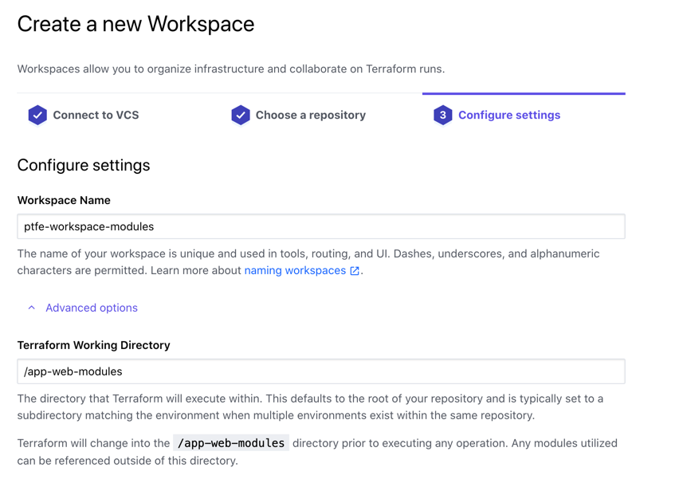
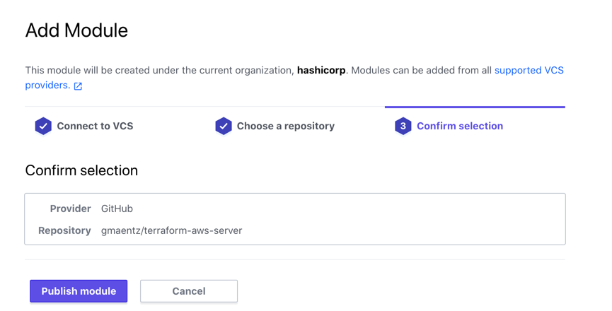

# Terraform Enterprise - Private Module Registry

## Expected Outcome

In this challenge you will register a module with your Private Module Registry then reference it in a workspace.

## How to:

### Create a Module Repository

Create a new GitHub repository, similar to early labs, with the name "terraform-aws-server".

Create a single `main.tf` with the following contents:

```hcl
variable ami {}
variable subnet_id {}
variable vpc_security_group_ids {
  type = list
}
variable identity {}
variable web_count {}

resource "aws_instance" "web" {
  ami                    = var.ami
  instance_type          = "t2.micro"
  subnet_id              = var.subnet_id
  vpc_security_group_ids = var.vpc_security_group_ids
  count                  = var.web_count

  tags = {
    "Identity"    = var.identity
    "Name"        = "Student"
    "Environment" = "Training"
  }
}

output "public_ip" {
  value = aws_instance.web.*.public_ip
}

output "public_dns" {
  value = aws_instance.web.*.public_dns
}
```

Commit the changes into GitHub.

### Update github repository

Back in your `ptfe-workspace` repository created earlier.

Add a new folder called `app-web-modules/`.

Create a single `main.tf` file with the following contents:

```hcl
provider "aws" {
}

module "server" {
  source = "app.terraform.io/YOUR_ORG_NAME/server/aws"

  ami                    = var.ami
  subnet_id              = var.subnet_id
  vpc_security_group_ids = var.vpc_security_group_ids
  identity               = var.identity
  web_count              = var.web_count
}
```

In your `app-web-modules` folder create a `variables.tf` file with the following contents:

```hcl
variable "ami" {}
variable "web_count" {}
variable "subnet_id" {}
variable "identity" {}
variable "vpc_security_group_ids" {
  type = list
}
```

Update the `source` argument on the module declaration to your TFE hostname and organization.

Commit the file and check the code into github.

### Create a workspace

Create a TFE workspace that uses the VSC connection to load your repository.

Select the repository and name the workspace "ptfe-workspace-modules" and select the working directory as "/app-web-modules".



### Add Modules

Before we can use our new module, we need to add it to the Private Module Registry.

Navigate back to Terraform Enterprise and click the "Modules" menu at the top of the page. From there click the "+ Add Module" button.


Select the repository you created above ("terraform-aws-server").



> Note: You will see your github user name since the repo is in your github account.

Click "Publish Module".

This will query the repository for necessary files and tags used for versioning.

> Note: this could take a few minutes to complete.

Congrats, you are done!

Ok, not really...

We need to tag the repository to be able to publish a version.

```sh
git tag v0.0.1 master
git push origin v0.0.1
```

### Configure Workspace Variables

Navigate back to your "ptfe-workspace-modules" workspace.

Set Environment and Terraform Variables for your aws provider (be sure check the 'sensitive' checkbox to hide the password):

Enter the following into the Variables section.  Your values will differ, but use those values that were in your `terraform.tfvars` file from previous labs.

```sh
ami                    = ami-03e33c1cefd1d3d74
subnet_id              = subnet-0a5e93f323f7f9138
identity               = terraform-training-ant
vpc_security_group_ids = ["sg-02713b4780094ac55"]
web_count              = 2
```

Enter the following into the Environment Variables section:

- AWS_ACCESS_KEY_ID
- AWS_SECRET_ACCESS_KEY
- AWS_DEFAULT_REGION

### Run a Plan

Click the "Queue Plan" button.


Wait for the Plan to complete.

You should see several additions to deploy your networking.

### Apply the Plan (Optional)

Approve the plan and apply it.

Watch the apply progress and complete.

## Extra Credit

1. Make a change to a module repository and tag it in such a way that the change shows in your Private Module Registry.

## Clean Up (if you ran apply)

Add an Environment variable to your workspace "CONFIRM_DESTROY=1".

Navigate to the workspace "Settings" -> "Destruction and Deletion".

Click Queue Destroy Plan.

Once the plan completes, apply it to destroy your infrastructure.

## Resources

- [Private Registries](https://www.terraform.io/docs/registry/private.html)
- [Publishing Modules](https://www.terraform.io/docs/registry/modules/publish.html)
